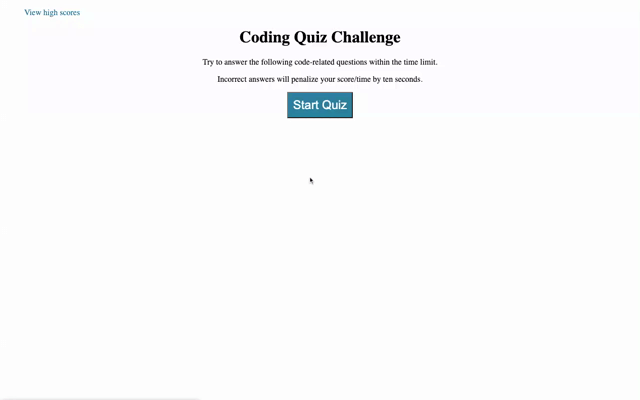
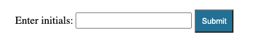
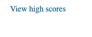

# Coding Quiz

## Site Screenshot

[Link to Deployed Website](https://ncguan.github.io/coding-quiz/)

## Technologies Used
- HTML
- CSS
- Javascript
- Git
- GitHub

## Summary
This project was built to take a timed coding quiz. The quiz stores past scores and can be used to gauge progress. A timer starts once the start button is clicked and a series of questions will be presented to the user after every answered question. If the user clicks an incorrect answer, time is subtracted from the timer. Once the quiz is over, after all questions are answered or the timer reaches 0, the user is presented with their score and can save their initials and score on the high scores list.

## Usage
Click on the 'Start Quiz' button to start the quiz timer and answer the quiz questions. 

When presented with a question, click on one of the blue buttons to submit your answer. Once the quiz has ended, you can save your score and initials by typing your initials in the text input field and click 'Submit' to view your score on the highscore list. 

You can take the quiz again by clicking the 'Go Back' button and clear the highscore list by clicking the 'Clear High Scores' button. 

High scores can also be viewed by clicking on the text 'View high scores' at the top left of the page.

## Author Links
[GitHub](https://github.com/ncguan)